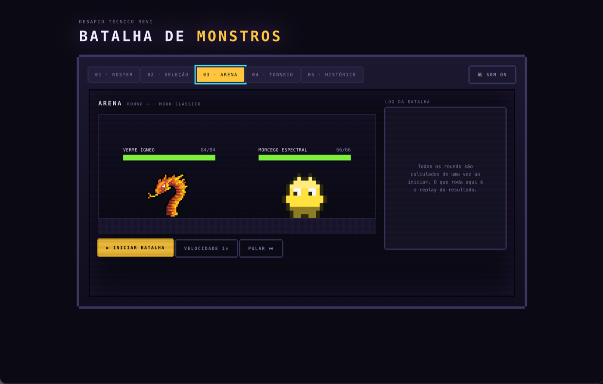
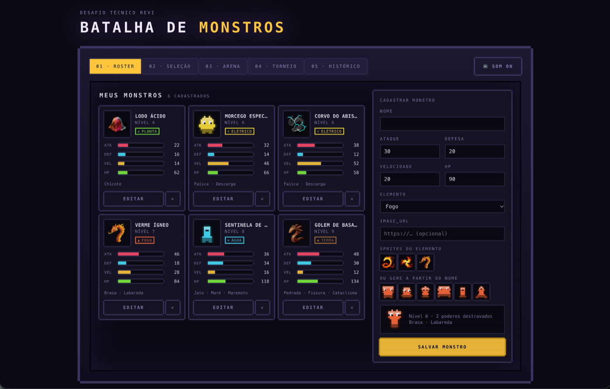
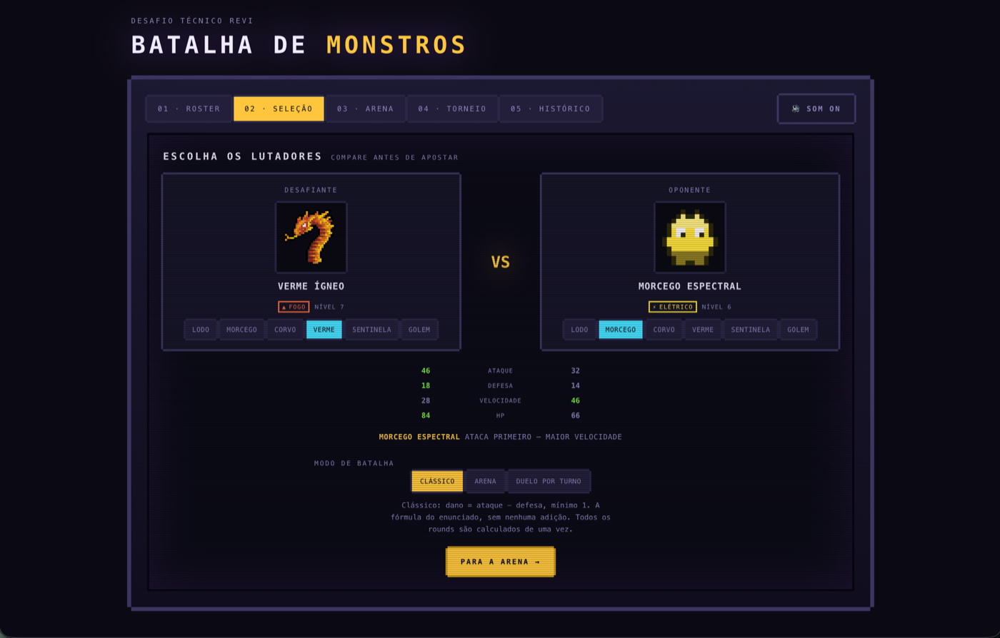
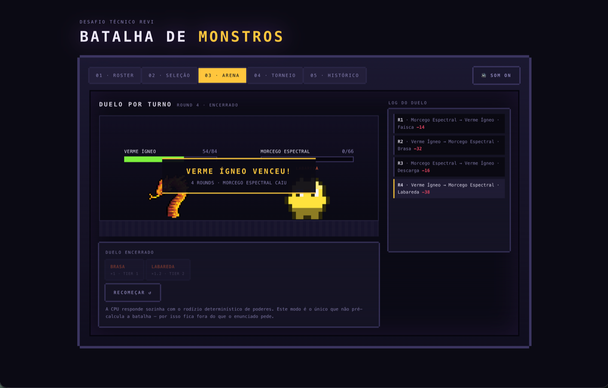
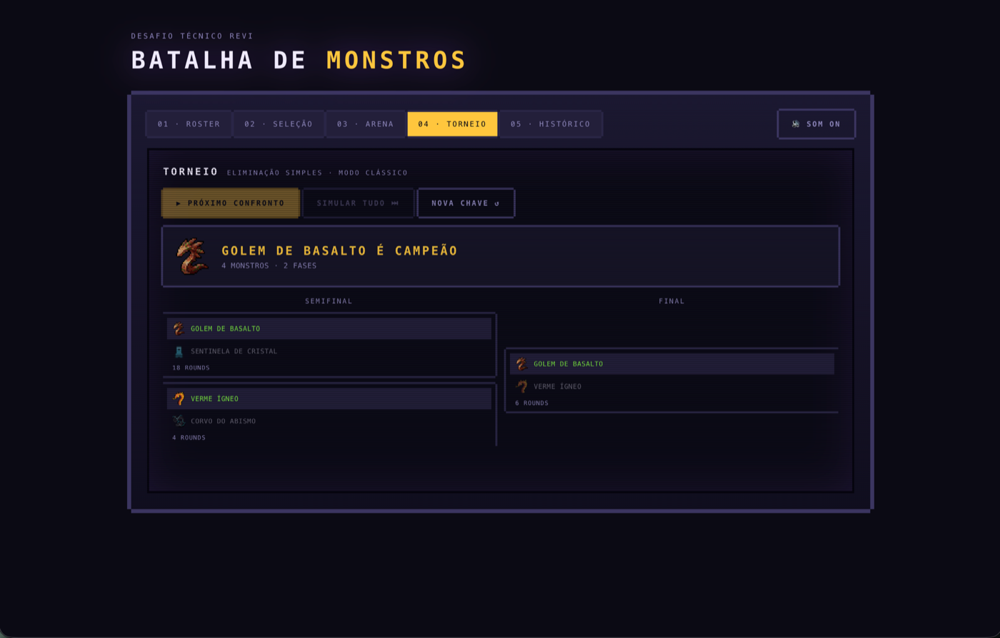
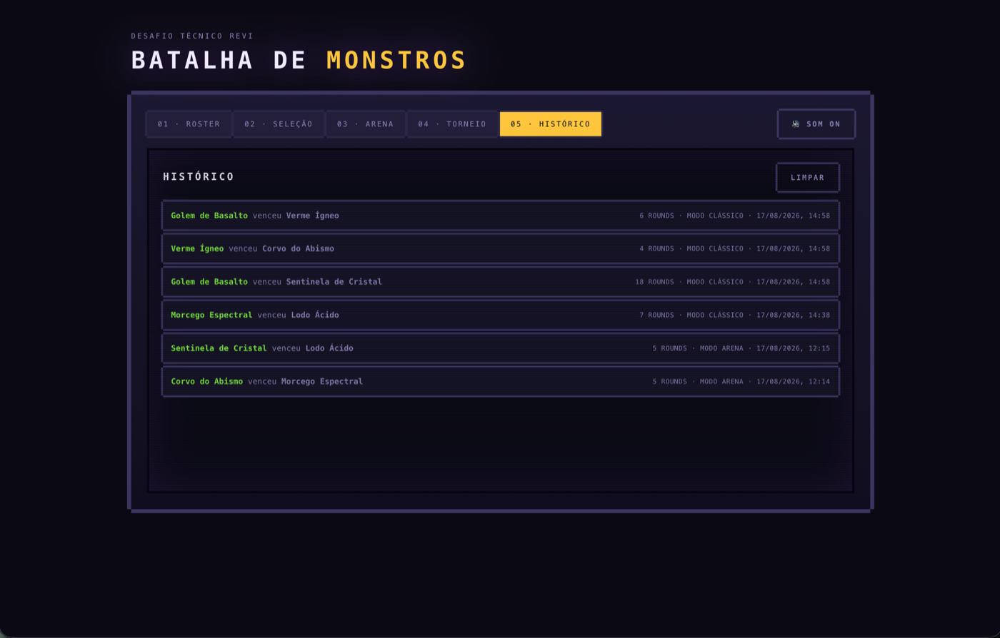

# Batalha de Monstros

Desafio técnico Revi. Aplicação React + TypeScript onde você cadastra monstros, escolhe dois e
assiste à batalha entre eles. Sem backend — tudo persiste em `localStorage`.

**Demo:** https://batalha-de-monstros.vercel.app



## O enunciado, e o resto

O **Modo Clássico** é o default da aplicação e implementa o enunciado ao pé da letra:
`damage = max(1, attack - defense)`, sem nenhuma adição. Quem abre o app e clica em batalhar está
vendo exatamente o algoritmo pedido. É o que a seção [O algoritmo de batalha](#o-algoritmo-de-batalha)
detalha, e o que `e2e/spec-compliance.spec.ts` prova pela interface.

Tudo além disso — tipos elementares, poderes, torneio, duelo por turno, som, histórico — é
extra. Eu gostei do desafio e continuei mexendo depois que os requisitos já estavam cumpridos.
Nada disso substitui o comportamento pedido: são modos e telas adicionais, sempre ao lado do
Clássico, nunca no lugar dele.

Os únicos desvios do enunciado no comportamento default estão declarados em
[O que diverge do enunciado, e por quê](#o-que-diverge-do-enunciado-e-por-quê).

## Como rodar

Requer Node.js 20 ou superior.

```bash
npm install
npm run dev
```

A aplicação sobe em http://localhost:5173.

```bash
npm run build     # build de produção em dist/
npm run preview   # serve o build localmente
npm test          # testes de domínio e de propriedade
npm run test:e2e  # testes end-to-end no navegador
npm run test:all  # os dois
npm run lint      # oxlint
```

Um único comando reproduz o que o CI roda:

```bash
npm run lint && npm run build && npm run test:all
```

## As telas

### 01 · Roster



Os seis campos do enunciado no formulário — nome, ataque, defesa, velocidade, HP e `image_url` —
mais o seletor de elemento. Validação com zod: erro no campo, não alerta genérico.

O **nível é derivado** dos atributos, não cadastrado, e determina quantos poderes o monstro
destrava. Por isso o formulário não ganha um campo a mais que o enunciado pede.

Para a imagem há três caminhos, na ordem em que a tela oferece: colar uma `image_url`, clicar num
dos sprites CC0 filtrados pelo elemento escolhido, ou usar uma das variações procedurais geradas a
partir do nome. O preview embaixo mostra o resultado e os poderes já destravados antes de salvar.

### 02 · Seleção



O comparativo marca em verde quem leva vantagem em cada atributo, e a linha abaixo já responde a
pergunta que o algoritmo decide primeiro: **quem ataca primeiro e por quê** — maior velocidade, ou
maior ataque no desempate.

Os três modos ficam visíveis aqui, com a fórmula em uso escrita embaixo. Escolher o monstro que já
está do outro lado troca os dois de lado, em vez de bloquear a seleção.

### 03 · Arena


A batalha inteira já está calculada quando a animação começa — o painel do log diz isso na cara do
usuário. O que roda na tela é o replay do resultado.

"Pular" mostra o final imediatamente, sem recalcular nada, e a velocidade do replay (1× / 2× / 4×)
não altera o desfecho.

### 03 · Arena — Duelo por turno



Modo extra em que você escolhe o golpe do seu monstro a cada rodada e a CPU responde com o rodízio
determinístico de poderes. O log nomeia o poder e o dano de cada round.

**É o único modo que não pré-calcula a batalha** — por definição, já que espera o clique do
jogador. Por isso está fora do que o enunciado pede, e a própria tela avisa isso.

### 04 · Torneio



Chave de eliminação simples com 4 ou 8 monstros, semeada pelos mais fortes do roster. Dá para
jogar confronto a confronto ou simular a chave inteira.

Cada confronto chama o mesmo `simulateBattle` do duelo 1×1. O torneio não reimplementa regra
nenhuma: só encadeia resultados e promove o vencedor para `(rodada + 1, slot / 2)`.

### 05 · Histórico



As últimas 20 batalhas, com vencedor, número de rounds, modo usado e data. Batalhas de torneio
entram aqui também, uma linha por confronto.

## O algoritmo de batalha

Implementado exatamente como o enunciado descreve, em `src/domain/battle/`:

1. Ataca primeiro quem tem maior `speed`. Velocidades iguais, resolve pelo maior `attack`.
2. `damage = attack - defense`. Se `attack <= defense`, o dano é `1`.
3. `hp = hp - damage` no monstro atacado.
4. Os monstros se revezam até um deles zerar o `hp` do outro.
5. **Todos os rounds são calculados de uma vez**, antes de qualquer animação.

```ts
simulateBattle(monsterA, monsterB) // → { winnerId, rounds: Round[], ... }
```

`simulateBattle` é uma função pura: sem React, sem IO, sem aleatoriedade. A mesma entrada sempre
produz o mesmo resultado.

Onde cada regra mora:

| Regra do enunciado | Arquivo |
|---|---|
| Maior `speed` ataca primeiro, desempate por `attack` | `src/domain/battle/turn-order.ts` |
| `damage = attack - defense`, piso de 1 | `src/domain/battle/damage.rules.ts` |
| `hp = hp - damage`, vencedor é quem zera o HP | `src/domain/battle/battle.state.ts` |
| Todos os rounds calculados de uma vez | `src/domain/battle/battle.engine.ts` |

## O que diverge do enunciado, e por quê

Dois pontos, ambos deliberados:

**HP para em zero.** O enunciado diz `hp = hp - damage`; o código faz `Math.max(0, hp - damage)`.
Isso não muda quem vence nem em quantos rounds — só evita exibir HP negativo na barra e no log.

**`element` é um campo a mais** no cadastro, além dos seis do enunciado. É o único, e sem ele não
haveria como ter tipos elementares. O nível, que também é usado pelos extras, é **derivado** dos
atributos justamente para não virar um segundo campo extra.

## Decisões de arquitetura

### A animação é replay, não simulação

O enunciado exige que os rounds sejam calculados de uma vez. Uma tela que mostra só o resultado
final cumpre isso, mas não é divertida. A saída foi separar cálculo de apresentação: o motor
devolve o array completo de rounds, e a UI percorre esse array.

Três consequências práticas: "Pular" mostra o resultado final sem recalcular nada; a barra de HP e
o log leem a mesma fonte, então nunca divergem; e mudar a velocidade do replay não altera o
resultado.

### Regra de dano injetada como estratégia

```ts
simulateBattle(a, b, 'classic') // fórmula do enunciado — default
simulateBattle(a, b, 'arena')   // + poder do round + vantagem elemental
```

Os dois modos usam o mesmo motor e devolvem a mesma estrutura. Só a função de dano muda. O motor
não sabe que elementos existem — quem sabe é a `DamageRule` que entra como argumento. É o que
mantém o Clássico literalmente igual ao enunciado, sem contaminação dos extras.

### Um resolvedor de round, dois drivers

`advanceRound(a, b, estado, poderEscolhido?)` resolve **um** round e devolve um estado novo. Em
cima dele existem dois modos de jogo, sem uma segunda implementação da regra para divergir:

- **Automático** (Clássico e Arena) — `simulateBattle` é um fold de `advanceRound` até alguém cair.
  Devolve o array completo antes de qualquer animação, como o enunciado exige.
- **Duelo por turno** — a UI chama o mesmo `advanceRound` a cada clique, passando o poder que o
  jogador escolheu; a CPU responde com o rodízio determinístico.

O poder escolhido pelo jogador só vale se pertencer ao elemento do atacante e se o nível dele já o
tiver destravado. A escolha na interface nunca vira privilégio sobre a regra.

### Camadas

```
src/domain/      regra de negócio pura — sem React, sem IO, 100% testável
src/store/       estado da aplicação (Zustand + persist)
src/features/    telas e seus componentes
src/components/  UI reutilizável
src/lib/         utilitários (sprite procedural, áudio, classes)
```

`domain/` não importa de nenhuma camada acima. É o que permite testar a regra de batalha sem montar
componente nenhum.

Pontos onde a estrutura evita repetição:

- `PixelPanel` é o único arquivo que declara a borda pixelada do tema.
- `StatBar` é o mesmo componente no card, no formulário e na comparação da seleção.
- `elements.ts` é a única fonte de verdade sobre elementos — alimenta a paleta do sprite, o badge,
  o catálogo de poderes e a cor do efeito visual.
- `PowerEffect` cobre as animações dos quinze poderes; a variação é dado, não código.
- `useBattleReplay` concentra todo o estado do replay, e os componentes da arena são apresentacionais.

O desenho completo, com as alternativas descartadas, está em [`docs/design.md`](docs/design.md).

## Além do enunciado

Tudo abaixo é adição. O comportamento default continua sendo o do enunciado.

**Tipos elementares.** Cinco elementos num ciclo fechado: Água → Fogo → Planta → Terra → Elétrico →
Água. Cada um é forte contra o próximo (×1.5) e fraco contra o anterior (×0.75). A relação sai da
posição no array por aritmética modular, sem matriz de matchup.

**Poderes.** Três por elemento, destravados nos níveis 1, 5 e 8, cada um com animação própria. A
escolha do poder no round é determinística: o atacante cicla pelos poderes destravados usando o
índice do turno. Sem aleatoriedade, porque a batalha inteira é calculada antes de começar.

**Nível derivado.** `level = clamp(1, 10, floor((attack + defense + speed + hp) / 24))`.

**Sprites em três camadas.** A `image_url` que você informar tem prioridade. Se estiver vazia ou
falhar ao carregar, um sprite pixel art é gerado a partir do nome e do elemento — a silhueta vem de
um passeio aleatório com seed, então mesmo nome e mesmo elemento sempre geram o mesmo monstro. O
formulário oferece as duas origens lado a lado: sprites CC0 filtrados pelo elemento escolhido, e
variações procedurais do nome. Nenhuma chamada de rede em runtime — os PNGs são servidos pelo
próprio app.

O roster inicial vem metade com sprite CC0 e metade em branco, de propósito, para as duas camadas
ficarem visíveis na primeira tela.

**Torneio e duelo por turno.** Detalhados acima, em [As telas](#as-telas).

**Histórico, CRUD e som.** As últimas 20 batalhas ficam salvas. Monstros podem ser editados e
excluídos. Os efeitos sonoros são sintetizados em WebAudio, sem nenhum arquivo de áudio no
repositório, e têm botão de mudo.

## Testes

O enunciado dispensa testes automatizados. Ainda assim há três camadas, porque cada uma responde a
uma pergunta diferente.

```bash
npm test          # 117 testes de domínio e propriedade (Vitest)
npm run test:e2e  # 49 testes de fluxo real no navegador (Playwright)
npm run test:all  # os dois
```

**Unidade — a regra está certa nos casos que eu previ.** Ordem de ataque e desempate, dano mínimo
1, HP nunca negativo, determinismo, ciclo de elementos, destravamento de poderes, validação do
cadastro, resiliência do estado salvo e promoção correta na chave do torneio.

**Propriedade — a regra está certa nos casos que eu não previ.** Com `fast-check`, cada invariante
roda contra 2.000 pares de monstros gerados dentro dos limites que o formulário aceita: a batalha
sempre termina, o dano é sempre inteiro e ≥ 1, o HP nunca sobe nem fica negativo, exatamente um
lado chega a zero, os atacantes sempre alternam, e trocar a ordem dos argumentos não muda quem
vence. Um exemplo escrito à mão nunca encontraria o par com defesa 99 e ataque 1.

**End-to-end — o usuário consegue fazer o que precisa.** Cadastro, edição e exclusão sobrevivendo
ao refresh; a batalha animando e o vencedor do banner batendo com o último round do log; o
histórico registrando; o torneio resolvendo a chave e promovendo o vencedor; o duelo por turno
aceitando o golpe escolhido; `localStorage` corrompido não derrubando a tela; e acessibilidade auditada
com `axe-core` em cada tela.

O arquivo `e2e/spec-compliance.spec.ts` merece destaque: ele existe para provar, pela interface, que
a aplicação cumpre o enunciado. Cria dois monstros com atributos conhecidos e verifica round a
round que o dano é exatamente `attack - defense`, que o piso de 1 vale, que o desempate por ataque
funciona e que o total de rounds já está definido no primeiro quadro da animação. Se alguém mudar a
regra, esse arquivo quebra mesmo que o motor continue verde.

### O que os testes já pegaram

O `axe-core` encontrou um defeito visual real que passou despercebido na revisão manual: a aba
selecionada aplicava `hover:text-paper` por cima do fundo âmbar, dando contraste de 1.34:1. Passar
o mouse sobre a aba ativa fazia o texto sumir. O mesmo padrão estava nos chips de seleção de
lutador. Corrigido em ambos.

## Acessibilidade e preferências

Barras de HP são `progressbar` com valores ARIA, as abas usam `role="tab"` e navegam por seta, Home
e End, o foco tem contorno visível, e `prefers-reduced-motion` desliga as animações.

## Como isso evoluiria para multiplayer

O enunciado dispensa backend, então não há nenhum aqui. Mas vale registrar por que a arquitetura
escolhida torna multiplayer barato, caso fosse o próximo passo.

`simulateBattle` é pura e determinística: mesma entrada, mesmo array de rounds, em qualquer
máquina. Isso permite **simulação em lockstep** — os dois clientes trocam apenas a entrada (quais
monstros, qual modo, qual seed se houver aleatoriedade futura) e cada um deriva localmente o mesmo
resultado. Não é preciso sincronizar HP, round atual ou animação; não há estado autoritativo para
divergir, e a banda usada é de dezenas de bytes por partida em vez de um evento por round.

O servidor viraria um matchmaker fino: parear jogadores, repassar as seleções, e — se houvesse
aposta ou ranking — reexecutar a mesma função pura para validar o resultado reportado. A função já
roda em Node sem alteração, porque não importa React nem toca em `window`.

O que mudaria no código: extrair `domain/` para um pacote compartilhado e adicionar uma camada de
transporte. Nenhuma reescrita do motor, do replay ou das telas. É esse o retorno de ter mantido a
regra de negócio livre de framework.

## Stack

React 19 · TypeScript · Vite · Tailwind CSS v4 · Zustand · zod · react-hook-form · Vitest ·
Playwright · fast-check · axe-core

## Créditos

Os 15 sprites em `public/sprites/` vêm do tileset [Dungeon Crawl 32x32
tiles](https://opengameart.org/content/dungeon-crawl-32x32-tiles), do Dungeon Crawl Stone Soup, sob
**CC0 1.0** (domínio público). Foram apenas renomeados com o prefixo do elemento; nenhum pixel
alterado. Detalhes e mapa de arquivos em [`public/sprites/CREDITS.md`](public/sprites/CREDITS.md).

## Licença

[MIT](LICENSE).
